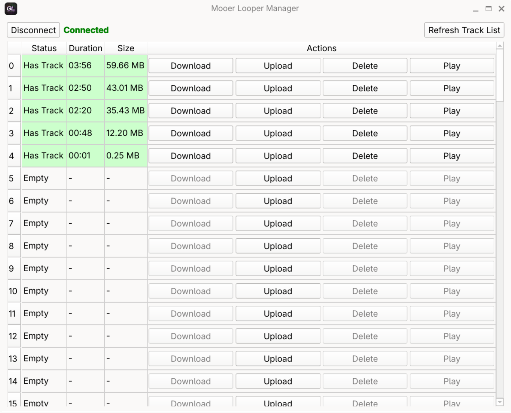

# Mooer Looper Manager

Manage tracks on your Mooer GL100/GL200 looper pedal from your computer. This is a C++ rewrite of the original Python version (found [here](https://github.com/shpala/PyMooerLooperManager)) with better performance and a cleaner UI.



## What it does

- Upload/download/delete tracks
- Stream audio directly from the pedal (no need to download first)
- Handle various WAV formats (mono/stereo, 16/24/32-bit)
- Auto-detect and select from multiple connected Mooer devices
- Automatic USB permission setup on Linux (installs udev rules when needed)
- Fast native performance with Qt6 and libusb

## Installation

### AppImage (easiest way)

Grab the latest AppImage from [Releases](https://github.com/shpala/MooerLooperManager/releases).

```bash
chmod +x MooerLooperManager-x86_64.AppImage
./MooerLooperManager-x86_64.AppImage
```

On Linux, if USB permissions are missing, the app will automatically prompt to install the required udev rules (requires administrator password).

### Building from Source

You'll need:
- C++17 compiler
- CMake 3.16+
- Qt6 (Core, Gui, Widgets, Multimedia, Network)
- libusb-1.0
- portaudio-2.0

**Debian/Ubuntu:**
```bash
sudo apt install build-essential cmake qt6-base-dev libqt6multimedia6-dev libusb-1.0-0-dev libportaudio2 portaudio19-dev pkg-config
```

**Arch:**
```bash
sudo pacman -S base-devel cmake qt6-base qt6-multimedia libusb portaudio
```

**Build it:**
```bash
mkdir build && cd build
cmake -DCMAKE_BUILD_TYPE=Release ..
make -j$(nproc)
```

**Make an AppImage:**
```bash
./packaging/appimage/build.sh
```

## Usage

1. Plug in your pedal (the app auto-detects connected devices)
2. Select your device from the dropdown
3. Hit **Connect**
4. Click **Refresh** to see your tracks
5. Use **Play** to stream audio straight from the device

## License

MIT - see [LICENSE](LICENSE)

## Credits

Based on reverse-engineering the Mooer GL100/GL200 protocol. Built with [Qt](https://www.qt.io/) and [libusb](https://libusb.info/).
